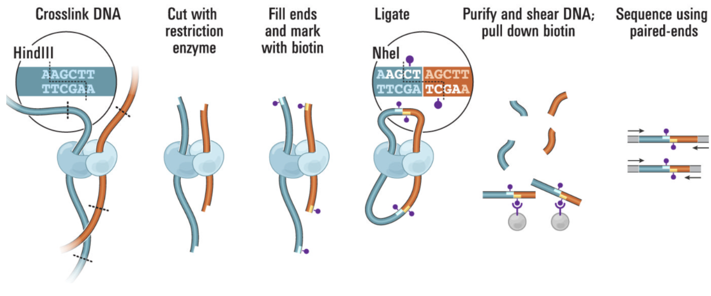
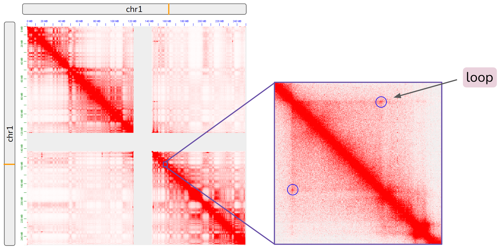
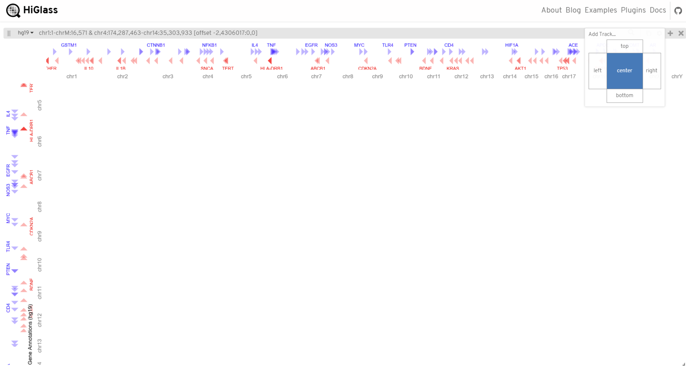
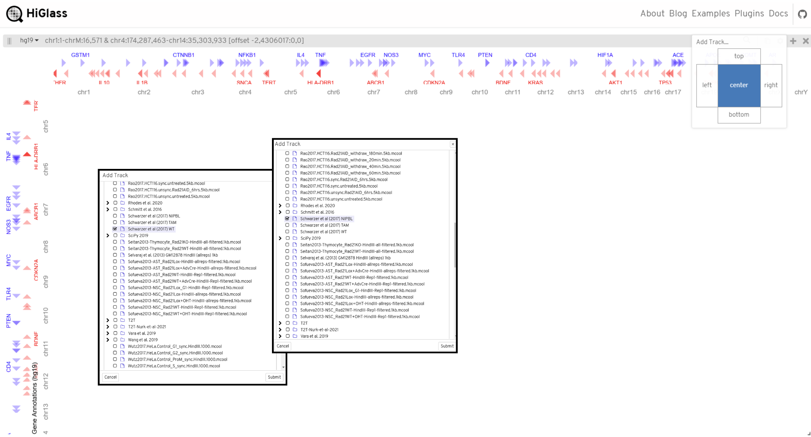
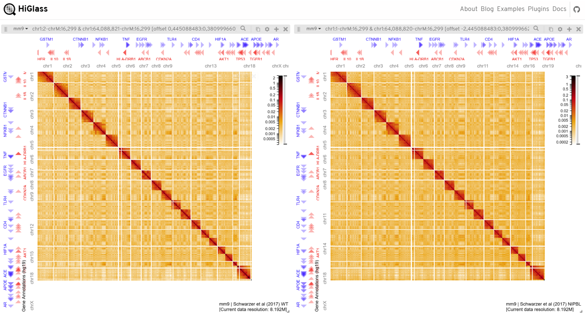
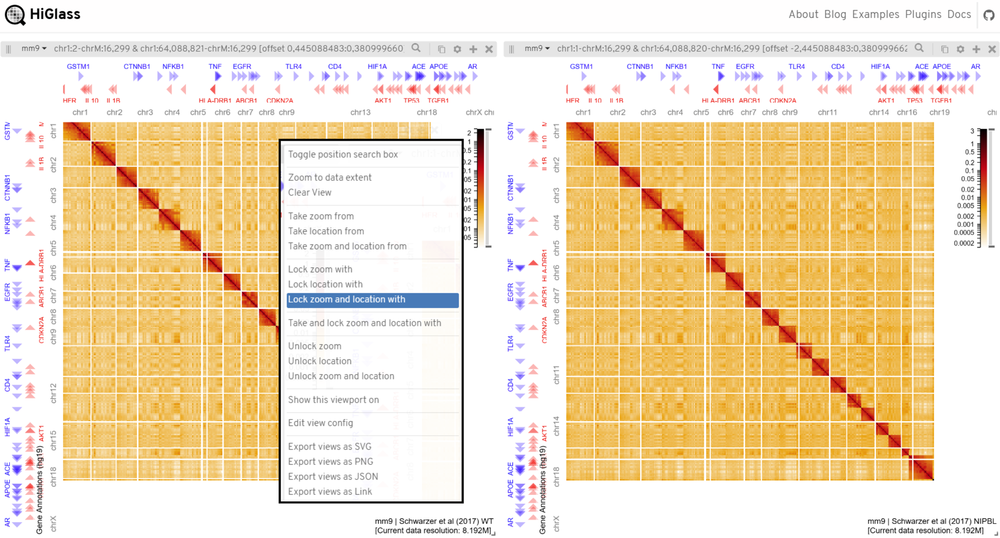
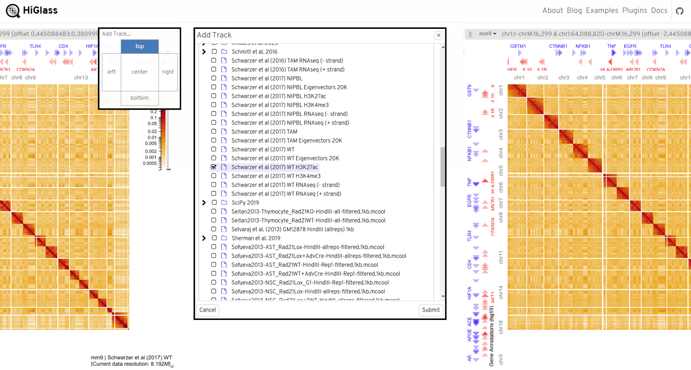
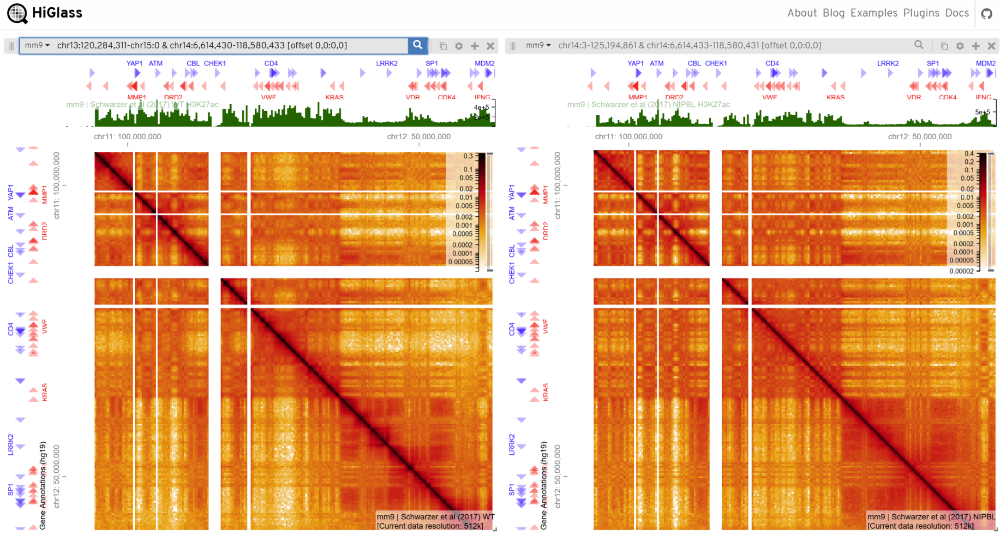
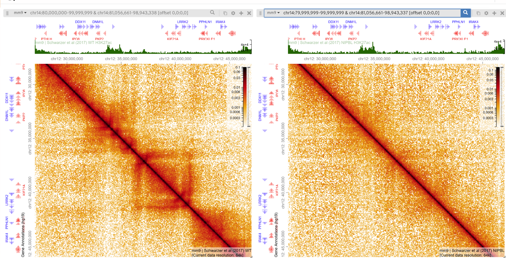

#  HiGlass: Visualizing Hi-C Assays
Group 2: Michael Chan, Kyra Fetter, Dhruv Khatri
1. [Introduction](#1)
2. [Overview](#2) 
    2.1. [Why HiGlass?](#21) 
    2.2. [How HiGlass Works](#22) 
    2.3. [Hi-C Background](#23)
3. [Tracks and Views](#3)
4. [Preparing Data for HiGlass](#4) 
    4.1. [2D Tracks](#41) 
    4.2. [1D Tracks](#42)

5. [HiGlass in Action: Case Study](#5)

## 1. Introduction

The past decade has seen unprecedented growth in the number of publicly available chromosome conformation capture (3C) datasets (Hi-C, HiChIP, etc.) released, in addition to corresponding 1D genomic datasets (ChIP-seq, ATAC-seq, etc.) produced due to efforts spearheaded by large consortiums like the 4D Nucleome Network and the ENCODE Project, alongside those of individual labs. This explosion in data output has prompted the need for sophisticated, seamless, and accessible data visualization tools in order to enable researchers to efficiently and effectively compare functional genomics and epigenomics datasets across multiple cell types, treatments, and conditions. 

HiGlass, developed in 2018 by the [HIDIVE Lab](https://hidivelab.org/) at Harvard Medical School, aims to address this need. HiGlass is an open source visualization tool for exploring large genomic datasets such as Hi-C contact matrices, enabling the visual interrogration of chromatin organization at multiple scales including compartments, TADs, and loops, among others, alongisde information from other high-throughput assays examining, for example, chromatin accessibility or transcription factor binding patterns. 

> Check out the tool for yourself at https://higlass.io 

## 2. Overview

#### Why HiGlass?
- data visualization in the last decade has advanced significantly.
- Specifically, the advent of Hi-C contact matrcies, which can contain over a billion cells and span many resolutions prompted the need to be able to explore these large datasets in a flexible manner at multuple scales.
> Further reading on Hi-C contact matrices and the assay itself is provided in the **Hi-C Background** section.
- examples of libraries (D3.js) and tools (vega, juicebox), 
- these methods fall short when analyzing large datasets. 
- inspired by online maps, higlass overcomes these issues with an interactable .
- describe downsampling and splicing techniques in blog
- concept of tiling and generic functions

#### How HiGlass Works
- remove

#### Hi-C Background

Hi-C is a high-throughput chromosome conformation capture (3C) assay developed initially in 2009. An *in situ* Hi-C protocol was introduced in 2014.  

In brief, Hi-C is performed as follows: cells are first cross-linked with formaldehyde, resulting in covalent links between segments of chromatin that are proximal in 3D space. DNA is then digested with a restriction enzyme. The 5’ ends are filled with nucleotides, one of which is biotinylated. The resulting fragments are ligated. Then, a Hi-C library is created by shearing the DNA and selecting fragments with biotin tags using streptavidin beads. The library is finally sequenced using paired-end sequencing.  

Hi-C can report chromatin interactions between all loci pairwise (all-by-all). These include both interchromosomal and intrachromosomal interactions and may be structural (define TAD boundaries and often marked by CTCF) or regulatory (connect cis-regulatory elements to their target genes). 

Interactions are typically represented as a contact matrix, with one axis as the genome, the other as the same genome, and each cell containing the number of times those two portions of the genome were caught in close proximity. The genome is binned in sizes ranging from 5kb to 50kb and the contact frequency between any two bins is represented on a color scale. Points of focal enrichment represent chromatin loops, as shown below: 

## 3. Tracks and Views
- describe the different applications of higlass possible bc of flexible tracks and views
- explain integrated/linked view of different types of data
- 2d and 1d tracks (fill in table below)
- insert figures of example tracks/applications from higlass examples page
<table>
 <tbody>
    <tr>
        <th>Method</td>
        <th>Targets</td>
        <th>Resolution</td>
        <th>Notes</td>
    </tr>
    <tr>
        <td>3C <a href="http://refhub.elsevier.com/S2001-0370(17)30093-4/rf0535">[3]</a></td>
        <td>one-vs-one</td>
        <td>~1–10 kb </td>
        <td><ul><li>Sequence of bait locus must be known</li><li>Easy data analysis</li><li>Low throughput</li></ul></td>
    </tr>
    <tr>
    <td>4C <a href="http://refhub.elsevier.com/S2001-0370(17)30093-4/rf0545">[4]</a></td>
    <td>one-vs-all</td>
    <td>~2 kb</td>
    <td><ul><li>Sequence of bait locus must be known</li><li>Detects novel contacts</li><li>Long-range contacts</li></ul></td>
    </tr>
    <tr>
    <td>5C <a href="http://refhub.elsevier.com/S2001-0370(17)30093-4/rf0550">[5]</a></td>
    <td>many-vs-many</td>
    <td>~1 kb</td>
    <td><ul><li>High dynamic range</li><li>Complete contact map of a locus</li><li>3C with ligation-mediated amplification (LMA) of a ‘carbon copy’ library of oligos designed across restriction fragment junctions of interest
3C</li></ul></td>
    </tr>
    <tr>
    <td>Hi-C <a href="http://refhub.elsevier.com/S2001-0370(17)30093-4/rf0300">[6]</a></td>
    <td>all-vs-all</td>
    <td>0.1–1 Mb</td>
    <td><ul><li>Genome-wide nucleosome core positioning</li><li>Relative low resolution</li><li>High cost</li></ul></td>
    </tr>
    <tr>
    <td>ChIA-PET <a href="http://refhub.elsevier.com/S0168-9525(15)00063-3/sbref1405">[7]</a></td>
    <td>Interaction of whole genome mediated by protein</td>
    <td>Depends on read depth and the size of the genome region bound by the protein of interest</td>
    <td><ul><li>Lower noise with ChIP</li><li>Biased method since selected protein</li></ul></td>
    </tr>
 </tbody>
</table>

## 4. Preparing Data for HiGlass
- data preparation blurb
#### 2D Tracks
- hi
#### 1D Tracks
- hi again

## 5. HiGlass in Action: Case Study

To explore the capabilities of HiGlass, we will examine a case study based off of the [Schwarzer, W., et al., 2017 Nature paper](https://www.nature.com/articles/nature24281). In this paper, they studied the effect of depleting NIBPL, a cohesin co-factor essential to chromatin loop formation through loop extrusion, on 3D genome architecture in adult mouse hepatocytes. 

First, begin by navigating to the HiGlass web app homepage: 

We will load two 2D tracks, one for wildtype (WT) and one for NIBPL knockdown. To do so, select "Add Track", the center panel, and choose our files of interest (add link to download here): 

This is what the HiGlass visualization should look like after both tracks have been added (WT on the left and NIBPL knockdown on the right): 

One of the novel features of HiGlass is its ability to create linked views, where zooming in or out or dragging a track in one view automatically scales or shifts the other views in sync. We can link the two views by selecting the settings icon in one of the views, clicking "Lock zoom and location with", and then choosing the other view: 

We can also add additional 1D tracks. Let's add a ChIP-seq signal track to each view. To do so, select the plus icon to add a new track, choose the top panel, and select the correct track file from the list: 

This is what the views look like once the 1D tracks have been added (see the green signal track above each contact map): 

Just like Google Maps, we can now zoom in on particular regions of interest on our contact maps. As an example, let's inspect the 20mb region on chr14. Enter the coordinates shown below into one of the search bars (we can do this for either view, as they are linked). Then select the search icon and zoom in to this region:  

Note the differences between the WT and NIBPL knockdown contact matrices: in the NIBPL knockdown, there is a clear loss of loops and TAD structures along the downward diagonal. From this region, we can infer that loop extrusion may not be able to occur as effectively in the absence of the NIBPL cohension loading factor. 

# References

[1] Fujita, Y., & Yamashita, T. (2021). Alterations in Chromatin Structure and Function in the Microglia. Frontiers in Cell and Developmental Biology, 8. https://doi.org/10.3389/fcell.2020.626541 

[2] Kerpedjiev, P., Abdennur, N., Lekschas, F., McCallum, C., Dinkla, K., Strobelt, H., Luber, J. M., Ouellette, S. B., Azhir, A., Kumar, N., Hwang, J., Lee, S., Alver, B. H., Pfister, H., Mirny, L. A., Park, P. J., & Gehlenborg, N. (2018). HiGlass: Web-based visual exploration and analysis of genome interaction maps. Genome Biology, 19(1), 125. https://doi.org/10.1186/s13059-018-1486-1 

[3] Rao, S. S. P., Huntley, M. H., Durand, N. C., Stamenova, E. K., Bochkov, I. D., Robinson, J. T., Sanborn, A. L., Machol, I., Omer, A. D., Lander, E. S., & Aiden, E. L. (2014). A 3D Map of the Human Genome at Kilobase Resolution Reveals Principles of Chromatin Looping. Cell, 159(7), 1665–1680. https://doi.org/10.1016/j.cell.2014.11.021 

[4] Risca, Viviana I., and William J. Greenleaf. "Unraveling the 3D genome: genomics tools for multiscale exploration." Trends in Genetics 31.7 (2015): 357-372. https://doi.org/10.1016/j.tig.2015.03.010 

[5] Schwarzer, W., Abdennur, N., Goloborodko, A., Pekowska, A., Fudenberg, G., Loe-Mie, Y., Fonseca, N. A., Huber, W., Haering, C. H., Mirny, L., & Spitz, F. (2017). Two independent modes of chromatin organization revealed by cohesin removal. Nature, 551(7678), 51–56. https://doi.org/10.1038/nature24281 

[6] https://higlass.io/examples 
